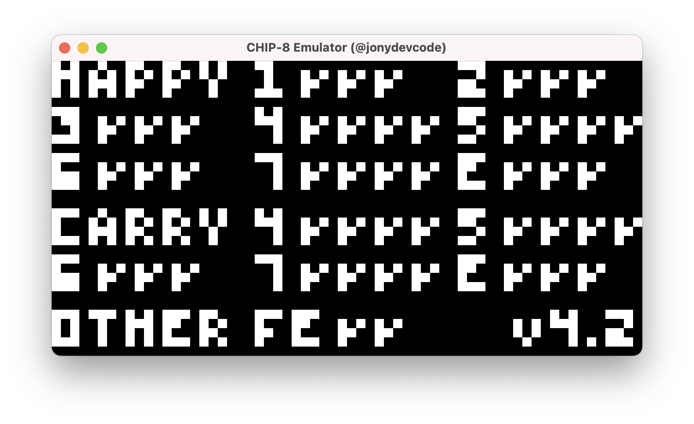
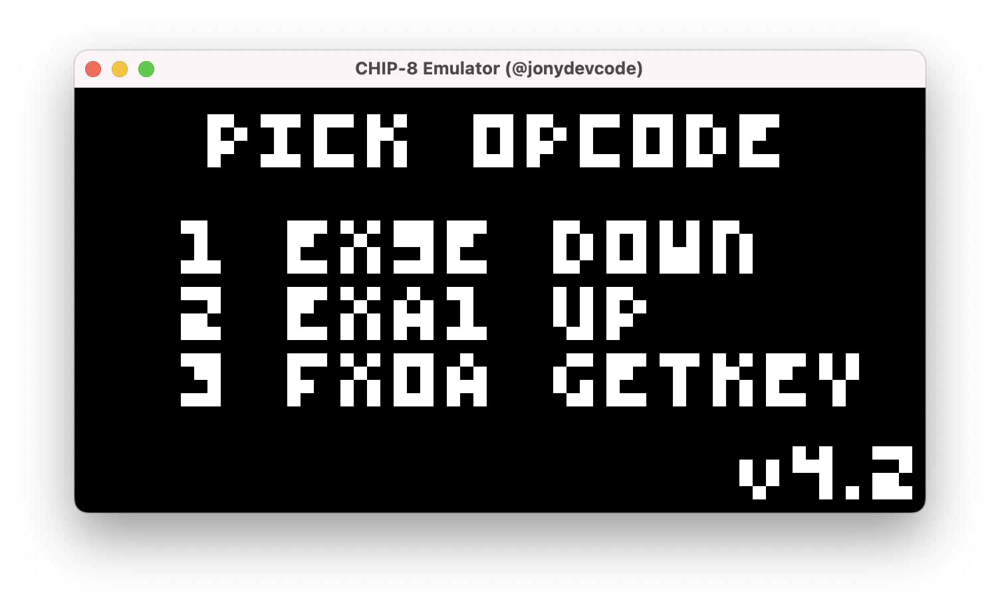
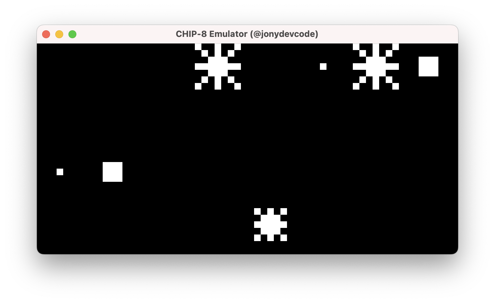
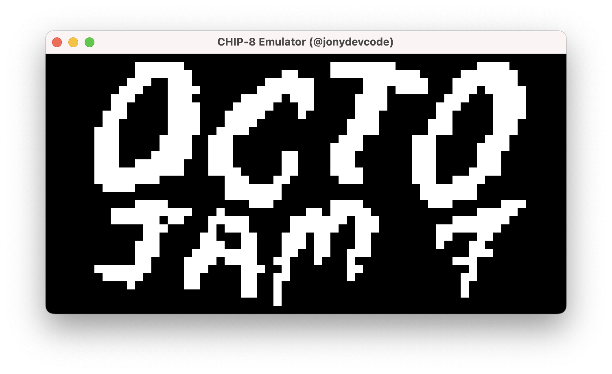

# CHIP-8 Emulator in Zig


[](./LICENSE)

A CHIP-8 emulator (actually interpreter) written in Zig. Uses SDL3 GPU API for display and inputs.


## AI Use Disclosure

The current contents of this repository were written without LLM/AI code generation. All AI usage in any form by contributors must be disclosed.

## Getting Started

### Dependencies

- Zig 0.16
- [castholm/SDL](https://github.com/castholm/SDL)

### Installing

```bash
zig build
```

### Executing program

```bash
zig build run -- rom_file.ch8
```

## Acknowledgments

- [zig](https://codeberg.org/ziglang/zig)
- [castholm/SDL](https://github.com/castholm/SDL)
- [Guide to making a CHIP-8 emulator](https://tobiasvl.github.io/blog/write-a-chip-8-emulator/)
- [Timendus/chip8-test-suit](https://github.com/Timendus/chip8-test-suite)

## License

Distributed under the MIT License. See [LICENSE](./LICENSE) for more information.

## Screenshots





